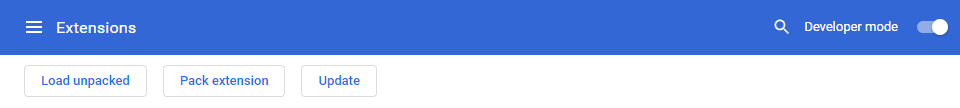

# Read Me
## This is a random team and we just post interesting code here.

We just copy and paste stuff we find in github and other sites we found on the internet.

### Rules: 

1) When you add a file here give credit to the creator.
  He deserves it and also put the original link.
  
2) No viruses. If you add a virus here without telling people its a virus you could be sued.

3) All content here has to be 7+ or lower. 

4) Don't mess up or delete ANY of the files.

5) Don't behave like a nimrod here and be nice.

## Instructions

### .exe
This only works on Windows. All you have to do is download it and you can open and use it right away.

### .zip
This is a chrome extension. This only works on [chrome](https://www.google.com/chrome/) and [browsers made from chromium.](https://www.zdnet.com/pictures/all-the-chromium-based-browsers/)
##### install .zip
First, go to chrome://extensions

Turn "Developer Mode" on.

Click "Load Unpacked"

Select the downloaded .zip file.

You're done! You now have the chrome extension.
